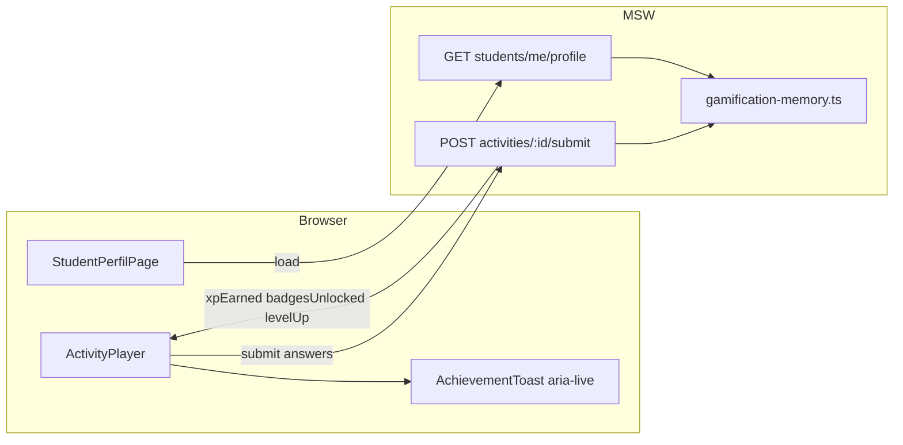

# Phase 7: Gamificação e Polimento - Research

**Researched:** 2026-05-21
**Domain:** Next.js 16 App Router gamification (mock), bundle budget RNF-001, Lighthouse CI, WCAG 2.1 AA audit
**Confidence:** HIGH (codebase + build metrics); MEDIUM (Lighthouse CI config details)

## Summary

Phase 7 completes the student **perfil** route (`/student/perfil`), wires **XP / nível / badges** through shared domain types and MSW, and extends **activity submit** so the player can show accessible achievement feedback. Performance work must keep the **student entry route** (`/student/dashboard`, post-login landing per `middleware.ts`) under **300KB gzip** JS — baseline production build today measures **~168KB gzip** for shared `rootMainFiles` on student routes (measured 2026-05-21), leaving ~132KB headroom before new gamification UI and any regressions.

The largest gzip contributor is a shared chunk (~71KB gzip, likely React + Next + MSW client path). **Do not add** animation libraries, chart libs, or toast packages; reuse the project’s lightweight `useState` toast pattern and upgrade it to **`aria-live="polite"`** (pattern already exists in `share-activity-panel.tsx`). Badge unlock state should live in an MSW in-memory module mirroring `teacher-content-memory.ts`, not only in static fixtures, so submit can mutate XP across sessions in dev.

Phases **5** (ping, SSE, legal copy) and **6** (tutor, adaptive trail) are **not implemented**. Phase 7 must ship against **Phase 3** surfaces now and document **integration hooks** (submit handler, activity layout, profile API) for later phases without blocking.

**Primary recommendation:** Add `StudentGamification` types + `GET /api/v1/students/me/profile` + extend `POST .../submit` response; build profile UI and `AchievementToast` with `aria-live`; gate bundle with `npm run analyze` and add **`@lhci/cli`** dev script targeting `/student/dashboard`; run WCAG checklist on **auth + student** flows now, defer tutor/realtime until routes exist.

## Architectural Responsibility Map

| Capability | Primary Tier | Secondary Tier | Rationale |
|------------|-------------|----------------|-----------|
| XP / level persistence (mock) | API / Backend (MSW handler) | — | PDR stores `xp`/`level` on `students`; mock state must match future NestJS |
| Badge definitions & unlock rules | API / Backend (MSW + fixtures) | Browser (display only) | Business rules belong in mock API, not scattered in components |
| Profile page UI (XP bar, badge grid) | Browser / Client | Frontend Server (SSR shell) | Interactive profile; optional RSC wrapper in `page.tsx` |
| Achievement feedback on submit | Browser / Client | API (submit response payload) | Player reads submit result and announces via `aria-live` |
| Bundle ≤300KB gzip | CDN / Static + build pipeline | Browser | Measured on production chunks per route |
| Lighthouse Performance ≥90 | CI / build verification | Browser runtime | Documented in VERIFICATION via LHCI or manual |
| WCAG AA audit | Browser / Client (markup) | Manual QA (NVDA/VoiceOver) | A11Y requirements are UI + manual validation |

<phase_requirements>

## Phase Requirements

| ID | Description | Research Support |
|----|-------------|------------------|
| GAME-01 | Perfil exibe XP e nível (mock, defaults schema) | `StudentProfile` type; `GET /api/v1/students/me/profile`; seed `xp: 120, level: 2`; `StudentProfileCard` + XP progress bar |
| GAME-02 | Badges desbloqueáveis mock (≥2) | `BadgeDefinition` + `gamification-memory.ts`; unlock on submit milestones; `BadgeGrid` |
| GAME-03 | Feedback de conquista acessível | `AchievementToast` with `role="status"` + `aria-live="polite"` + visible text (not animation-only); extend submit response |
| PERF-01 | Bundle entrada aluno ≤300KB gzip | Baseline 168KB measured; tactics: lucide per-icon imports, no new deps, optional `dynamic()` for heavy student-only islands, MSW dev-only awareness |
| PERF-02 | Lighthouse Performance ≥90 | `@lhci/cli@0.15.1` + `.lighthouserc.cjs`; audit `/student/dashboard` after `npm run build && npm run start` |
| A11Y-01 | Fluxos críticos navegáveis por teclado | Checklist for login, register, dashboard, player, perfil; fix focus order / disabled traps |
| A11Y-02 | `alt` / `aria-hidden` em imagens e ícones | Lucide `aria-hidden` pattern; badge images (if any) need `alt` or decorative hiding |
| A11Y-03 | Contraste WCAG AA | Use existing semantic tokens; verify badge locked/unlocked states and XP bar in light/dark |

</phase_requirements>

## Project Constraints (from .cursor/rules/)

| Source | Directive |
|--------|-----------|
| `validation-build.mdc` | Run `npm run lint`, `npm audit`, production `npm run build` before merge |
| `code-architecture.mdc` | SRP, DRY, no mixed UI+persistence+business rules in one file |
| `accessibility.mdc` | Keyboard access, logical focus, NVDA/VoiceOver on critical flows, semantic HTML, WCAG AA contrast |
| `responsive-mobile.mdc` | Touch ≥44px, mobile-first, test real devices |
| User rules (performance) | Lighthouse Performance >90, LCP ≤2.5s, bundle budget, WebP/AVIF + `alt` on images |

## Standard Stack

### Core (no new runtime dependencies)

| Library | Version | Purpose | Why Standard |
|---------|---------|---------|--------------|
| `next` | 16.2.6 | App Router, `dynamic()`, build analyzer | Already in repo; RNF-001 cites Next bundle optimizations [CITED: doc/PDR_VisionEdu.md] |
| `react` | 19.2.4 | Client islands for profile/player toast | Project standard |
| `msw` | 2.14.6 | Mock profile + mutable XP on submit | Phase 1 pattern; handlers in `students.ts` |
| `lucide-react` | 1.16.0 | Badge icons (named imports only) | Already used; tree-shake friendly when importing symbols individually [CITED: existing `learning-path-timeline.tsx`] |
| `zod` | 4.4.3 | Optional response validation in tests | Existing validation stack |
| `vitest` | 4.1.7 | MSW contract + gamification memory tests | Existing test runner |

### Supporting (dev-only)

| Library | Version | Purpose | When to Use |
|---------|---------|---------|-------------|
| `@next/bundle-analyzer` | ^15.1.0 | PERF-01 measurement | Already wired; `npm run analyze` [VERIFIED: README.md] |
| `@lhci/cli` | 0.15.1 | PERF-02 CI gate | Add as `devDependency`; `lhci autorun` after production server [VERIFIED: npm registry + slopcheck OK] |

### Alternatives Considered

| Instead of | Could Use | Tradeoff |
|------------|-----------|----------|
| `@lhci/cli` | Manual Lighthouse in Chrome DevTools | Faster for one-off; not repeatable in VERIFICATION.md |
| `@lhci/cli` | `unlighthouse-ci` full-site scan | Heavier; overkill for single-route PERF-02 |
| Custom toast lib (`sonner`) | Inline `aria-live` region | Saves ~5–15KB+ gzip; Phase 3 CONTEXT preferred no heavy toast dep |
| CSS-only XP bar | Chart library | Recharts would blow RNF-001 budget [CITED: .planning/research/PITFALLS.md] |

**Installation (dev only):**

```bash
npm install -D @lhci/cli@0.15.1
```

**Version verification:**

```bash
npm view @lhci/cli version   # 0.15.1
npm view lighthouse version # 13.3.0 (transitive)
```

## Package Legitimacy Audit

| Package | Registry | Age | Downloads | Source Repo | slopcheck | Disposition |
|---------|----------|-----|-----------|-------------|-----------|-------------|
| `@lhci/cli` | npm | Mature (GoogleChrome) | High | github.com/GoogleChrome/lighthouse-ci | OK | Approved (devDependency only) |

**Packages removed due to slopcheck [SLOP] verdict:** none

**Packages flagged as suspicious [SUS]:** none

*Gamification UI uses zero new runtime packages.*

## Architecture Patterns

### System Architecture Diagram



### Recommended Project Structure

```
src/
├── types/domain.ts                    # + StudentProfile, Badge, ActivitySubmitResult fields
├── mocks/
│   ├── data/student-gamification.ts   # Badge catalog + default profile seed
│   ├── gamification-memory.ts         # Mutable xp/level/unlocked (like teacher-content-memory)
│   └── handlers/students.ts           # + GET profile, extend POST submit
├── services/student.service.ts          # + getProfile()
├── features/student/
│   ├── components/
│   │   ├── xp-progress-bar.tsx
│   │   ├── badge-grid.tsx
│   │   ├── achievement-toast.tsx
│   │   └── student-profile-view.tsx   # composes bar + grid
│   └── __tests__/gamification.test.ts
├── app/student/perfil/page.tsx          # Replace placeholder
└── .lighthouserc.cjs                  # PERF-02 (repo root)
```

### Pattern 1: Domain types aligned to PDR `students` table

**What:** Extend `src/types/domain.ts` with gamification fields matching PDR §9 (`xp` default 0, `level` default 1). Badges are **frontend mock catalog** (no PDR table — document as MVP extension).

**When to use:** All MSW handlers, services, and UI import these types only.

```typescript
// src/types/domain.ts (additions)
export type BadgeId = "first_activity" | "high_score" | "path_starter";

export interface BadgeDefinition {
  id: BadgeId;
  title: string;
  description: string;
  icon: "trophy" | "star" | "route"; // maps to lucide component name
}

export interface StudentBadgeState {
  id: BadgeId;
  unlockedAt: string | null; // ISO date or null
}

export interface StudentProfile {
  xp: number;
  level: number;
  xpToNextLevel: number; // mock computed field for progress bar
  badges: StudentBadgeState[];
}

export interface ActivitySubmitResult {
  score: number;
  status: "completed";
  xpEarned: number;
  totalXp: number;
  level: number;
  levelUp?: boolean;
  badgesUnlocked: BadgeId[];
}
```

### Pattern 2: MSW mutable gamification state

**What:** `src/mocks/gamification-memory.ts` holds current `xp`, `level`, `unlockedBadgeIds: Set<BadgeId>`. Handlers read/write this module.

**When to use:** Every `POST submit` increments XP and evaluates badge rules; `GET profile` returns snapshot.

**Unlock rules (mock, deterministic):**

| Badge ID | Trigger |
|----------|---------|
| `first_activity` | First successful submit in session memory |
| `high_score` | `score >= 9.0` on any submit |
| `path_starter` | Submit while linked activity matches `demoLearningPathModules` in-progress module |

**XP formula (mock):** `xpEarned = Math.round(score * 10)`; `level = Math.floor(totalXp / 100) + 1`; `xpToNextLevel = level * 100 - totalXp`.

### Pattern 3: MSW API contracts

| Method | Route | Response |
|--------|-------|----------|
| GET | `/api/v1/students/me/profile` | `StudentProfile` |
| POST | `/api/v1/students/activities/:id/submit` | Extended `ActivitySubmitResult` |

Update `studentService.getProfile()` and keep `submitActivity` return type in sync.

### Pattern 4: Accessible achievement toast (GAME-03)

**What:** Reuse teacher copy-link pattern from `share-activity-panel.tsx` (sr-only `aria-live` + visible message).

```tsx
// src/features/student/components/achievement-toast.tsx
export function AchievementToast({ message }: { message: string | null }) {
  if (!message) return null;
  return (
    <div className="rounded-lg border border-primary/30 bg-primary/5 px-3 py-2">
      <p className="text-sm font-medium text-foreground">{message}</p>
      <span role="status" aria-live="polite" className="sr-only">
        {message}
      </span>
    </div>
  );
}
```

**Wire in `activity-player.tsx`:** After successful submit, build message: `"Você ganhou {xpEarned} XP."` + optional `"Nível {level}!"` + badge titles unlocked. Auto-dismiss 5s; do not rely on color animation alone.

### Pattern 5: Profile page composition

**What:** `src/app/student/perfil/page.tsx` renders `StudentProfileView` (client) fetching `studentService.getProfile()` on mount.

**UI elements:**

- **XP bar:** `<progress>` or div with `role="progressbar"`, `aria-valuenow`, `aria-valuemin={0}`, `aria-valuemax={xpToNextLevel}`, label `"Progresso para o nível {level + 1}"`
- **Level display:** heading + numeric XP
- **Badge grid:** `ul` / `li`, each badge: icon (`aria-hidden`), title, description; locked badges use `opacity-50` + `aria-label="Badge {title}, bloqueado"`

### Pattern 6: Bundle optimization (PERF-01)

**Measured baseline (2026-05-21, `npm run build`, student routes):**

| Route | rootMainFiles gzip sum |
|-------|------------------------|
| `/student/dashboard` | **168.3 KB** |
| `/student/atividade/[id]` | 168.3 KB (shared chunks) |
| `/student/perfil` | 168.3 KB |

**Tactics (prescriptive):**

1. **No new runtime dependencies** for gamification.
2. **Lucide:** continue named imports (`import { Trophy } from "lucide-react"`), never `import *`.
3. **Do not import `qrcode`** into student routes (teacher-only today — keep it that way).
4. **MSW:** loaded via dynamic `import("@/mocks/browser")` in `MswProvider` — for Lighthouse perf runs, document `NEXT_PUBLIC_USE_MOCK=false` build OR accept mock overhead in pilot; executor should record which was used in VERIFICATION.
5. **Fonts:** root layout loads `Roboto` + `Geist` — if bundle tight, discretion to drop one weight/subset in Phase 7 (flag in plan, measure with analyzer).
6. **`next/dynamic`:** optional for `StudentProfileView` if analyzer shows profile-specific code pushing dashboard route — prefer shared light components first.
7. **Verify:** `npm run analyze` → inspect student dashboard chunk; record gzip in `07-VERIFICATION.md`.

### Pattern 7: Lighthouse CI (PERF-02)

**Recommended:** `@lhci/cli` local + optional GitHub Actions later.

```javascript
// .lighthouserc.cjs — Source: [CITED: github.com/GoogleChrome/lighthouse-ci]
module.exports = {
  ci: {
    collect: {
      startServerCommand: "npm run start",
      startServerReadyPattern: "ready",
      url: ["http://localhost:3000/student/dashboard"],
      numberOfRuns: 3,
      settings: {
        preset: "desktop", // or "mobile" for RNF-002 alignment — pick one and document
        onlyCategories: ["performance"],
      },
    },
    assert: {
      assertions: {
        "categories:performance": ["error", { minScore: 0.9 }],
      },
    },
    upload: { target: "filesystem", outputDir: ".planning/phases/07-gamifica-o-e-polimento/lhci" },
  },
};
```

**package.json scripts:**

```json
"lhci": "lhci autorun",
"perf:student": "npm run build && lhci autorun"
```

**Manual fallback (MVP yolo):** Chrome DevTools Lighthouse on `/student/dashboard` after `npm run build && npm run start`; screenshot scores into VERIFICATION.

**Auth note:** Lighthouse hits dashboard without cookie → will redirect to `/login`. **Collect URL must use authenticated session** — options: (a) LHCI `puppeteerScript` login stub, (b) temporary public preview route (not recommended), (c) manual Lighthouse logged-in. Planner should add task for **authenticated audit** (storageState or scripted login).

### Anti-Patterns to Avoid

- **Animation-only rewards:** confetti/Lottie without text fails GAME-03 and A11Y.
- **XP only in React state:** breaks refresh and profile tab; must persist in MSW memory.
- **Duplicating toast without `aria-live`:** current `student-dashboard.tsx` uses `role="status"` only — upgrade in Phase 7.
- **Importing teacher QR stack into student layout:** pulls `qrcode` into student bundle.
- **Blocking Phase 7 on Phase 5/6:** ship hooks, not full tutor/realtime a11y.

## Don't Hand-Roll

| Problem | Don't Build | Use Instead | Why |
|---------|-------------|-------------|-----|
| XP level curve | Custom DSL | Simple integer math in MSW | MVP mock; backend will own rules later |
| Toast / announcements | Custom global event bus | `aria-live` region component | WCAG; already proven in teacher share panel |
| Bundle size guess | Manual file sizes | `@next/bundle-analyzer` + gzip sum | INFR-04 / PERF-01 require measured proof |
| Lighthouse runs | Ad-hoc screenshots only | `@lhci/cli` assert `minScore: 0.9` | Repeatable PERF-02 gate |
| Badge SVG pipeline | Inline random SVGs | `lucide-react` icons | Consistent, tree-shaken, `aria-hidden` |

**Key insight:** Gamification here is **presentation + mock state**, not a new domain engine. Keep rules in MSW memory module.

## Common Pitfalls

### Pitfall 1: Submit response not extended

**What goes wrong:** Player shows score only; GAME-02/03 unmet.

**Why:** `ActivitySubmitResult` and handler still return `{ score, status }` only (`students.ts` line 45).

**How to avoid:** Update type + handler + `activity-player.tsx` in same plan wave.

**Warning signs:** Vitest `submitActivity` test still expects two fields only.

### Pitfall 2: Profile still placeholder

**What goes wrong:** GAME-01 fails; bottom nav Perfil tab useless.

**Why:** `src/app/student/perfil/page.tsx` explicitly defers to Phase 7.

**How to avoid:** Replace with `StudentProfileView` wired to `getProfile`.

### Pitfall 3: Bundle regression over 300KB

**What goes wrong:** PERF-01 fails after adding profile + toast.

**Why:** Shared chunk already ~168KB; MSW + React dominate.

**How to avoid:** Run `npm run analyze` per task; no new deps; defer heavy optional UI.

**Warning signs:** New chunk >50KB in analyzer for student route.

### Pitfall 4: Lighthouse on unauthenticated URL

**What goes wrong:** Score measures login page, not dashboard.

**Why:** Middleware redirects unauthenticated users to `/login`.

**How to avoid:** Scripted login or stored session in LHCI config.

### Pitfall 5: A11y audit scope creep

**What goes wrong:** Phase blocked waiting for tutor/realtime routes.

**Why:** ROADMAP lists those flows in success criteria but phases 5/6 incomplete.

**How to avoid:** Split checklist: **now** vs **defer** (documented below).

### Pitfall 6: Badge catalog drift from PDR

**What goes wrong:** Future NestJS has no `badges` table.

**Why:** PDR only defines `xp` and `level` on `students`.

**How to avoid:** Document badges as MVP mock extension; IDs stable for future API.

## Code Examples

### MSW handler sketch (submit + profile)

```typescript
// src/mocks/handlers/students.ts — extend existing handlers
import { getProfile, applyActivityCompletion } from "@/mocks/gamification-memory";

http.get("/api/v1/students/me/profile", () => {
  return HttpResponse.json(getProfile());
}),

http.post("/api/v1/students/activities/:id/submit", async ({ params, request }) => {
  const id = String(params.id);
  // ... existing 404 guard ...
  const body = (await request.json()) as { answers?: ActivityAnswer[] };
  const result = applyActivityCompletion(id, body.answers ?? []);
  return HttpResponse.json(result);
}),
```

### Activity player submit UX

```typescript
// After studentService.submitActivity — activity-player.tsx
const result = await studentService.submitActivity(activityId, answers);
const parts = [`Você ganhou ${result.xpEarned} XP.`];
if (result.levelUp) parts.push(`Você subiu para o nível ${result.level}!`);
if (result.badgesUnlocked.length) {
  parts.push(`Novas conquistas: ${result.badgesUnlocked.map(titleForBadge).join(", ")}.`);
}
setAchievementMessage(parts.join(" "));
```

### Vitest contract test

```typescript
// src/features/student/__tests__/gamification.test.ts
it("submitActivity returns xp and badges", async () => {
  const result = await studentService.submitActivity(DEMO_ACTIVITY_ID, []);
  expect(result.xpEarned).toBeGreaterThan(0);
  expect(result.totalXp).toBeGreaterThan(0);
  expect(Array.isArray(result.badgesUnlocked)).toBe(true);
});

it("getProfile returns xp level and badges", async () => {
  const profile = await studentService.getProfile();
  expect(profile.level).toBeGreaterThanOrEqual(1);
  expect(profile.badges.length).toBeGreaterThanOrEqual(2);
});
```

## State of the Art

| Old Approach | Current Approach | When Changed | Impact |
|--------------|------------------|--------------|--------|
| Perfil placeholder | Full profile + MSW profile endpoint | Phase 7 | GAME-01 |
| Submit `{score,status}` | Submit includes gamification payload | Phase 7 | GAME-02/03 |
| Toast without aria-live | sr-only + aria-live polite | Phase 7 | GAME-03, A11Y |
| No Lighthouse automation | LHCI 0.15.x | Phase 7 | PERF-02 |

**Deprecated/outdated:**

- Relying on IndexedDB for activity draft — Phase 3 locked `localStorage` (D-05); do not change in Phase 7.

## Integration Hooks (Phases 5 & 6 — not built)

| Future phase | Hook location | Suggested extension |
|--------------|---------------|---------------------|
| Phase 5 ping | `activity-player.tsx` mount | Do not double-count XP on ping; XP stays on submit only |
| Phase 5 legal banner | Student layout / player | Ensure banner + achievement toast don't fight for `aria-live` — single live region per page |
| Phase 6 tutor chat | `/student/atividade/[id]` | Add tutor panel as sibling; toast region at top, tutor messages in `log` role region |
| Phase 6 diagnostic complete | New MSW `POST /diagnostics/:id/complete` | Call `applyDiagnosticCompletion()` in gamification-memory for badge `diagnostic_done` (defer badge until route exists) |
| Phase 6 adaptive trail | Dashboard timeline | Optional badge `recomposition_started` when module inserted — UI only |

## A11y Audit Scope

### Audit now (routes exist)

| Flow | Key paths | Focus |
|------|-----------|-------|
| Auth login | `/login` | Tab order, role selector, error `role="alert"`, focus on submit error |
| Auth register student | `/register/student` | Labels, multi-field focus, Zod errors linked to inputs |
| Auth register teacher | `/register/teacher` | Same + dynamic class rows |
| Student dashboard | `/student/dashboard` | Timeline buttons, toast → add `aria-live`, heading hierarchy |
| Student activities list | `/student/atividades` | Links ≥44px, list semantics |
| Student activity player | `/student/atividade/[id]` | `fieldset`/`legend`, progressbar, sticky controls keyboard reachable |
| Student perfil | `/student/perfil` | XP progressbar labels, badge grid screen reader text |
| Student entrar | `/student/entrar?code=` | Redirect flow, error states |
| Teacher (sample) | share panel, forms | Copy `aria-live` pattern; contrast on badges |

### Defer until Phase 5/6 routes exist

| Flow | Requirement | Action in Phase 7 |
|------|-------------|-------------------|
| Tutor socrático | A11Y-01/03 + GAME-03 overlap | Document stub checklist in VERIFICATION; no code |
| Tempo real professor | REAL-* + A11Y | Note dependency; optional placeholder in audit doc |
| Ping / tab focus banner | REAL-01 | Hook comment in activity-player only |

**Deliverable:** `.planning/phases/07-gamifica-o-e-polimento/07-A11Y-CHECKLIST.md` (planner task) with pass/fail columns per route.

## Assumptions Log

| # | Claim | Section | Risk if Wrong |
|---|-------|---------|---------------|
| A1 | Student entry route for PERF-01 is `/student/dashboard` | PERF-01 | Wrong route measured → false pass |
| A2 | `rootMainFiles` gzip sum approximates Next "First Load JS" for budget | PERF-01 | May omit shared layout CSS/fonts — verify with analyzer |
| A3 | Badge catalog is frontend-only (no PDR table) | GAME-02 | Backend may model badges differently later |
| A4 | XP formula `score * 10` and level `floor(xp/100)+1` acceptable for mock | Pattern 2 | Product may want different curve |
| A5 | LHCI needs custom login script for authenticated dashboard | PERF-02 | Scores login page without it |
| A6 | `NEXT_PUBLIC_USE_MOCK=true` remains default in pilot builds | PERF-02 | MSW inflates perf vs production API |

## Open Questions (RESOLVED)

1. **Lighthouse mobile vs desktop preset** — **RESOLVED**
   - **Decision:** **Mobile** preset is the contract for PERF-02 (aligns RNF-002 mobile-first).
   - **Implementation:** `.lighthouserc.cjs` uses `settings.preset: "mobile"` (see 07-02-PLAN.md).
   - Desktop scores are informational only in `07-VERIFICATION.md`.

2. **Whether to reduce fonts in root layout for bundle headroom** — **RESOLVED**
   - **Decision:** Measure-first via `npm run analyze` and `scripts/measure-student-bundle.mjs`; do **not** subset fonts unless gzip exceeds 280KB after 07-01.
   - **Rationale:** Baseline ~168KB leaves headroom; font changes risk design regression without proven need.

## Environment Availability

| Dependency | Required By | Available | Version | Fallback |
|------------|------------|-----------|---------|----------|
| Node.js | build, LHCI | ✓ | v22.22.0 | — |
| npm | scripts | ✓ | (with Node) | — |
| Production build | PERF-01/02 | ✓ | `next build` succeeds | — |
| `@lhci/cli` | PERF-02 | ✗ (not installed) | — | Manual Lighthouse |
| slopcheck | package audit | ✓ | 0.6.1 | Mark packages ASSUMED |
| ctx7 CLI | docs lookup | ✗ | — | WebFetch / official docs |

**Missing dependencies with no fallback:**

- None blocking — LHCI install is one devDependency add.

## Validation Architecture

### Test Framework

| Property | Value |
|----------|-------|
| Framework | Vitest 4.1.7 |
| Config file | `vitest.config.ts` |
| Quick run command | `npm run test` |
| Full suite command | `npm run test` |

### Phase Requirements → Test Map

| Req ID | Behavior | Test Type | Automated Command | File Exists? |
|--------|----------|-----------|-------------------|-------------|
| GAME-01 | Profile API returns xp, level, ≥2 badges | unit/integration | `npx vitest run src/features/student/__tests__/gamification.test.ts -t profile` | ❌ Wave 0 |
| GAME-02 | Submit unlocks badge id in response | unit/integration | `npx vitest run src/features/student/__tests__/gamification.test.ts -t submit` | ❌ Wave 0 |
| GAME-03 | Achievement message includes text (aria-live in component test optional) | unit | `npx vitest run src/features/student/__tests__/achievement-toast.test.tsx` | ❌ Wave 0 |
| PERF-01 | Student dashboard JS ≤300KB gzip | manual/script | `npm run analyze` + node gzip script on build-manifest | ❌ Document in VERIFICATION |
| PERF-02 | Lighthouse performance ≥90 | manual/CI | `npm run perf:student` (after LHCI add) | ❌ Wave 0 |
| A11Y-01 | Keyboard tab through login + player | manual | Checklist `07-A11Y-CHECKLIST.md` | ❌ Wave 0 |
| A11Y-02 | Icons decorative | manual/code review | grep `aria-hidden` on lucide in new components | partial ✓ |
| A11Y-03 | Contrast AA on badge states | manual | axe DevTools or checklist | ❌ Wave 0 |

### Sampling Rate

- **Per task commit:** `npm run test` + `npm run lint`
- **Per wave merge:** `npm run build` + bundle gzip note
- **Phase gate:** LHCI or manual Lighthouse ≥90 documented; A11Y checklist signed; full test green

### Wave 0 Gaps

- [ ] `src/features/student/__tests__/gamification.test.ts` — GAME-01, GAME-02
- [ ] `src/mocks/gamification-memory.ts` — mutable mock state
- [ ] `src/mocks/data/student-gamification.ts` — badge catalog + defaults
- [ ] `.lighthouserc.cjs` + `npm run perf:student` — PERF-02
- [ ] `07-A11Y-CHECKLIST.md` — A11Y manual gate
- [ ] Extend `student.service.ts` + `domain.ts` types

## Security Domain

### Applicable ASVS Categories

| ASVS Category | Applies | Standard Control |
|---------------|---------|------------------|
| V2 Authentication | no (display only) | Session already Phase 2 |
| V3 Session Management | no | — |
| V4 Access Control | yes (profile student-only) | MSW assumes authenticated student; middleware enforces role |
| V5 Input Validation | low (submit answers) | Existing POST body; no new user-controlled HTML |
| V6 Cryptography | no | — |

### Known Threat Patterns

| Pattern | STRIDE | Standard Mitigation |
|---------|--------|---------------------|
| XSS via achievement message | Tampering/Spoofing | React text nodes only; no `dangerouslySetInnerHTML` |
| Client-side XP manipulation | Elevation | Mock only — real API will authorize server-side later |

## Risks and Dependencies

| Risk | Severity | Mitigation |
|------|----------|------------|
| Phase 5/6 not done | Medium | Implement against Phase 3; document hooks only |
| Bundle near budget (~168KB) | Medium | No new deps; measure each wave |
| LHCI auth redirect | High | Scripted login in LHCI collect |
| No Phase 7 CONTEXT.md | Low | Follow ROADMAP + PDR defaults |
| MSW memory resets on full page reload in dev | Low | Acceptable for MVP; seed defaults xp=120 |

## Sources

### Primary (HIGH confidence)

- Codebase: `src/types/domain.ts`, `src/mocks/handlers/students.ts`, `activity-player.tsx`, `student/perfil/page.tsx`, `middleware.ts`
- Production build chunk measurement (local `npm run build`, 2026-05-21)
- `doc/PDR_VisionEdu.md` — RNF-001, RNF-002, `students.xp`/`level`
- `.planning/REQUIREMENTS.md` — GAME/PERF/A11Y IDs
- `.planning/research/PITFALLS.md` — bundle pitfall
- `README.md` — bundle analyzer
- slopcheck: `@lhci/cli` OK

### Secondary (MEDIUM confidence)

- [GoogleChrome/lighthouse-ci](https://github.com/GoogleChrome/lighthouse-ci) — LHCI configuration pattern
- [Unlighthouse LHCI guide](https://unlighthouse.dev/learn-lighthouse/lighthouse-ci) — Next.js `startServerCommand` (cross-checked with LHCI repo)

### Tertiary (LOW confidence)

- Exact mapping of `rootMainFiles` gzip sum to Next.js "First Load JS" label — validate with bundle analyzer UI

## Metadata

**Confidence breakdown:**

- Standard stack: **HIGH** — uses existing repo stack only
- Architecture: **HIGH** — patterns mirror Phase 3/4 MSW memory
- Pitfalls: **HIGH** — baseline metrics measured locally
- LHCI authenticated flow: **MEDIUM** — needs executor validation

**Research date:** 2026-05-21
**Valid until:** 2026-06-21 (stable stack); 2026-06-07 for LHCI details

---

## RESEARCH COMPLETE

**Phase:** 7 - Gamificação e Polimento
**Confidence:** HIGH

### Key Findings

- Perfil is a placeholder; `User` / `ActivitySubmitResult` lack XP fields — extend `domain.ts` + MSW + `student.service.ts`.
- Student route JS gzip baseline **~168KB** (shared chunks) — under 300KB but MSW/React dominate; no new runtime deps.
- Accessible toast pattern exists in `share-activity-panel.tsx`; student dashboard toast needs `aria-live`.
- `@lhci/cli@0.15.1` is legitimate for PERF-02; authenticated Lighthouse run required for dashboard.
- A11y audit **now**: auth + student flows; **defer**: tutor + realtime (phases 5/6).

### File Created

`.planning/phases/07-gamifica-o-e-polimento/07-RESEARCH.md`

### Confidence Assessment

| Area | Level | Reason |
|------|-------|--------|
| Standard stack | HIGH | No new runtime packages; verified versions |
| Architecture | HIGH | Mirrors `teacher-content-memory` + Phase 3 MSW |
| Pitfalls | HIGH | Measured build gzip; codebase gaps confirmed |
| LHCI | MEDIUM | Auth/session setup for CI not prototyped |

### Open Questions

- Lighthouse **mobile** vs desktop preset for contract
- Optional font subsetting if analyzer shows regression

### Ready for Planning

Research complete. Planner can create `07-01` … `07-03` PLAN.md files with Wave 0 test/LHCI setup.
