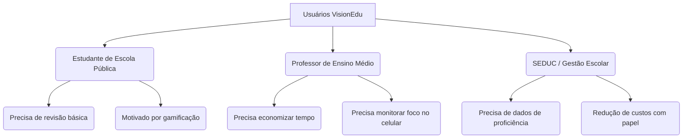
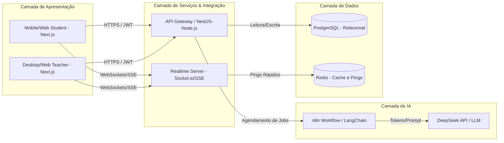
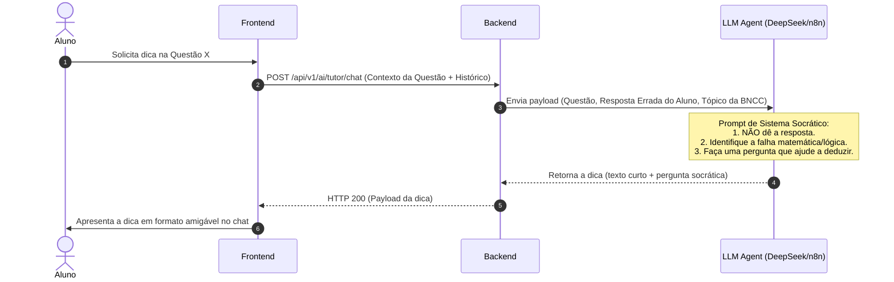

# VisionEdu - Product Development Requirements (PDR)

## Documento Mestre de Especificação de Requisitos e Arquitetura do Produto

### Versão 1.1 (MVP)

---

## 1. Controle de Documentação


| Versão  | Data       | Autor / Papel                                               | Descrição das Alterações                                                                                                       |
| ------- | ---------- | ----------------------------------------------------------- | ------------------------------------------------------------------------------------------------------------------------------ |
| **1.0** | 20/05/2026 | **Antigravity** (Senior PM, Software Architect & Tech Lead) | Consolidação dos requisitos de produto, arquitetura técnica, modelo de dados, fluxos de IA e conformidade jurídica para o MVP. |
| **1.1** | 20/05/2026 | **Antigravity** (Senior PM, Software Architect & Tech Lead) | Inclusão da seção oficial de Stack de Desenvolvimento e alinhamento da arquitetura técnica ao frontend Next.js.                |


---

## 2. Visão Geral do Produto e Objetivos

### 2.1 Contexto e Justificativa (Problem-Solution Fit)

O projeto **VisionEdu** origina-se no contexto das escolas públicas de Ensino Médio do Estado do Piauí (especificamente do **CETI Luiz Ubiraci de Carvalho, GRE 16ª, Vila Nova do Piauí**). Identificou-se que o processo de aprendizagem não ocorre de forma uniforme. Alunos ingressam no Ensino Médio com lacunas graves em conceitos fundamentais do Ensino Fundamental (como porcentagem em matemática ou interpretação de texto), o que compromete a absorção de conteúdos mais complexos (como física cinemática). 

Adicionalmente, os professores enfrentam salas populosas (média de 30 alunos) e rotinas administrativas pesadas, tornando o suporte individualizado inviável durante o tempo regular de aula.

### 2.2 Visão de Futuro

Ser a plataforma web de referência nacional em **recomposição de aprendizagem e acompanhamento pedagógico auxiliado por Inteligência Artificial**, transformando o celular do aluno em um dispositivo estritamente pedagógico dentro da sala de aula e estendendo a aprendizagem para fora dela.

### 2.3 Objetivos do MVP

1. **Identificar lacunas de aprendizagem** por meio de avaliações diagnósticas inteligentes.
2. **Recomendar trilhas adaptativas** que recomponham conceitos básicos necessários para o progresso do aluno.
3. **Disponibilizar um tutor de IA socrático**, que ajude o aluno a resolver problemas por mérito próprio, fornecendo pistas cognitivas em vez de respostas diretas.
4. **Dar visibilidade em tempo real ao professor** sobre a participação e o foco do aluno em sala de aula.
5. **Recuperar em média 20% do tempo de aula** do professor através de relatórios automatizados de dificuldades e automação de correções.

---

## 3. Personas do Usuário




### 3.1 Thiago, 16 anos - O Estudante

- **Perfil:** Aluno do 2º ano do Ensino Médio Integrado ao Técnico. Possui um celular antigo com internet móvel limitada.
- **Necessidades:** Tem vergonha de expor suas dúvidas na frente de 30 colegas. Sente extrema dificuldade em Física (Cinemática), mas não sabe que o problema real está na falta de base matemática para equações simples de 1º grau.
- **Comportamento na Plataforma:** Acessa pelo celular (mobile-first), engaja-se por mecânicas de conquistas (badges) e usa o chat socrático para tirar dúvidas sem julgamento.

### 3.2 Professora Regina, 42 anos - A Docente

- **Perfil:** Leciona Matemática e Física em duas escolas estaduais, totalizando 10 turmas e mais de 300 alunos.
- **Necessidades:** Precisa preparar aulas personalizadas, mas seu tempo extraclasse é consumido corrigindo provas físicas e preenchendo diários de classe.
- **Comportamento na Plataforma:** Utiliza o desktop na sala dos professores para criar atividades diagnósticas e acompanha em tempo real no celular quem está concentrado na atividade durante a aula.

### 3.3 Gestor Escolar / SEDUC-PI - Os Tomadores de Decisão

- **Perfil:** Administradores públicos focados na melhoria dos índices do IDEB e SAEPI.
- **Necessidades:** Reduzir custos com impressões de apostilas de reforço, diminuir taxas de reprovação/abandono escolar e obter dados agregados de proficiência por competência da BNCC.

---

## 4. Conformidade Legal e Regulamentar

> [!IMPORTANT]
> **Enquadramento na Lei Federal nº 15.100 (Janeiro de 2025)**
> A plataforma VisionEdu foi desenhada estritamente sob as exceções da Lei Federal nº 15.100/2025, que proíbe o uso de aparelhos eletrônicos por alunos da educação básica dentro de sala de aula.
>
> A lei permite a utilização sob as seguintes condições, as quais o VisionEdu atende integralmente:
>
> 1. **Uso estritamente pedagógico**, associado aos conteúdos curriculares trabalhados.
> 2. **Sob supervisão e prévia autorização** do professor regente.
> 3. **Mecanismo de Controle de Presença Ativa (Dashboard do Professor)**: O painel do professor exibe um indicador dinâmico ("Ping de Atividade") que prova em tempo real se o celular do aluno está executando a atividade pedagógica do VisionEdu ou se o aluno saiu do navegador, garantindo a supervisão exigida por lei.

---

## 5. Requisitos Funcionais (MVP)

Abaixo estão detalhados os requisitos funcionais prioritários do MVP.

### 5.1 Épico 1: Autenticação e Sessão (AUTH)

- **RF-001 (Cadastro Adaptativo):** 
  - O cadastro deve distinguir **Aluno** (dados: Nome Completo, E-mail, Senha, Escola, Série [1º, 2º ou 3º ano], Turma [ex: "A", "B"]) e **Professor** (dados: Nome Completo, E-mail, Senha, Escolas Vinculadas, Séries e Turmas que leciona).
- **RF-002 (Autenticação e Sessão):** 
  - Login tradicional por e-mail/senha.
  - Geração de JWT para controle de sessões.
  - Tempo de expiração de sessão do Aluno: 8 horas (evitando desconexões durante o período escolar).

### 5.2 Épico 2: Perfil do Aluno e Gamificação (STUDENT)

- **RF-003 (Painel do Aluno):**
  - Exibição dos dados escolares e histórico de desempenho (atividades concluídas, score médio).
- **RF-004 (Trilha Ativa de Estudo):**
  - Visualização gráfica do caminho de aprendizagem sugerido pela IA baseado no diagnóstico.

### 5.3 Épico 3: Painel do Professor e Acompanhamento (TEACHER)

- **RF-005 (Dashboard da Turma):**
  - Visão agregada do desempenho da turma (médias de notas, conceitos com maiores taxas de erro).
- **RF-006 (Relatório de Lacunas BNCC):**
  - Relatório gerado automaticamente indicando quais competências da BNCC (ex: EM13MAT302) a turma domina ou tem dificuldade.

### 5.4 Épico 4: Gestão de Conteúdo e Atividades (CONTENT)

- **RF-07 (Criador de Materiais e Atividades):**
  - Professor pode postar textos, links de vídeo e PDFs categorizados por Disciplina (ex: Matemática, Física), Série e Turma.
- **RF-08 (Gerador de Avaliações Diagnósticas):**
  - Criação de questionários de múltipla escolha associando cada questão a uma **habilidade da BNCC**.
- **RF-09 (Compartilhamento Direto):**
  - Geração de links curtos ou QR Codes para compartilhamento rápido das atividades no início das aulas.

### 5.5 Épico 5: Motor de Recomendação de Trilhas e Tutor Socrático (AI)

- **RF-010 (Diagnóstico Adaptativo):**
  - A IA analisa as respostas da avaliação diagnóstica inicial. Se o aluno errar uma questão de física que depende de álgebra, a IA sinaliza a falha conceitual base (ex: "Equação de 1º Grau") na tabela de lacunas.
- **RF-011 (Geração de Trilha Personalizada):**
  - A IA reorganiza a sequência de conteúdos para o estudante, inserindo módulos curtos de recomposição de base antes de liberá-lo para prosseguir com o conteúdo regular da turma.
- **RF-012 (Tutor Socrático de IA):**
  - Chat embutido na interface de resolução de questões.
  - O aluno pode solicitar ajuda. O prompt do sistema (System Prompt) instrui o Large Language Model (LLM) a **não revelar o gabarito**, mas sim fazer perguntas orientadoras ou dar dicas analógicas ("pistas cognitivas") baseadas no erro cometido pelo aluno.

---

## 6. Requisitos Não Funcionais (RNF)

- **RNF-001 (Performance e Conectividade Instável):**
  - A plataforma deve ser otimizada para conexões móveis 3G/4G lentas. O tamanho total do bundle JavaScript inicial do frontend não deve passar de 300KB (gzip).
  - Cache local de dados estáticos para garantir que o aluno não perca o progresso de uma questão caso a internet caia temporariamente.
- **RNF-002 (Responsividade Mobile-First):**
  - A interface deve ser 100% utilizável em smartphones de entrada com resoluções a partir de 360px de largura de tela.
- **RNF-003 (Segurança e LGPD):**
  - Armazenamento e tratamento de dados de menores de idade em conformidade com a LGPD (Lei Geral de Proteção de Dados). É necessária a autorização dos responsáveis no cadastro (ou vínculo à matrícula escolar autorizada pelo Estado).
  - Hash de senhas usando `bcrypt`.

---

## 7. Stack de Desenvolvimento

A stack abaixo define as tecnologias oficiais do MVP VisionEdu, escolhidas para equilibrar produtividade de desenvolvimento, tipagem estática, performance em dispositivos móveis e integração com fluxos de Inteligência Artificial.

### 7.1 Frontend (Camada de Apresentação)


| Tecnologia       | Papel no produto                                                                                           |
| ---------------- | ---------------------------------------------------------------------------------------------------------- |
| **Next.js**      | Framework full-stack React com roteamento, SSR/SSG e otimizações de bundle para conexões lentas (RNF-001). |
| **TypeScript**   | Tipagem estática em todo o frontend, reduzindo erros de integração com a API NestJS.                       |
| **React**        | Biblioteca de interface para painéis do aluno (mobile-first) e do professor (desktop e mobile).            |
| **Tailwind CSS** | Sistema de design utilitário para interfaces responsivas a partir de 360px de largura (RNF-002).           |


### 7.2 Backend (Camada de Serviços)


| Tecnologia     | Papel no produto                                                                                                          |
| -------------- | ------------------------------------------------------------------------------------------------------------------------- |
| **NestJS**     | API REST modular em Node.js com TypeScript; autenticação JWT, módulos de turma, conteúdo, atividades e integração com IA. |
| **PostgreSQL** | Banco relacional principal para usuários, escolas, turmas, conteúdos, avaliações, trilhas e resultados diagnósticos.      |


### 7.3 Inteligência Artificial e Automação


| Tecnologia    | Papel no produto                                                                                                             |
| ------------- | ---------------------------------------------------------------------------------------------------------------------------- |
| **LangChain** | Orquestração de prompts, contexto socrático e encadeamento de chamadas ao LLM (tutor e diagnóstico adaptativo).              |
| **N8N**       | Automação de workflows (agendamento de jobs, webhooks, integrações com APIs de LLM de baixo custo, como DeepSeek ou Gemini). |


> **Nota:** LangChain e N8N são complementares — LangChain concentra a lógica conversacional e de raciocínio pedagógico; N8N pode acionar pipelines assíncronos (relatórios BNCC, filas de processamento) sem bloquear a API principal.

### 7.4 Visão consolidada

```text
┌─────────────────────────────────────────────────────────────┐
│  Frontend: Next.js + TypeScript + React + Tailwind CSS      │
├─────────────────────────────────────────────────────────────┤
│  Backend:  NestJS (Node.js + TypeScript)                    │
├─────────────────────────────────────────────────────────────┤
│  Dados:    PostgreSQL                                       │
├─────────────────────────────────────────────────────────────┤
│  IA:       LangChain  |  N8N                                │
└─────────────────────────────────────────────────────────────┘
```

---

## 8. Arquitetura Técnica do Sistema

### 8.1 Visão Geral da Arquitetura




### 8.2 Complementos de Infraestrutura

A stack oficial está definida na **Seção 7**. Além dela, o MVP prevê os seguintes componentes de suporte:

- **Realtime (Foco do Aluno):** Server-Sent Events (SSE) para notificações unidirecionais simples do servidor, ou WebSockets (Socket.io) para comunicação bidirecional de pings.
- **Redis:** Controle de sessão temporária, cache e armazenamento em memória dos pings de atividade dos alunos em tempo real (complemento ao PostgreSQL).
- **LLMs externos:** Integração via LangChain e/ou N8N a APIs de baixo custo e alta performance, como **DeepSeek-V3** ou **Gemini 1.5 Flash**.

---

## 9. Modelo de Dados (Schema Relacional)

Abaixo está a modelagem física inicial do banco de dados relacional (PostgreSQL).

```mermaid
erDiagram
    USERS {
        uuid id PK
        varchar email UK
        varchar password_hash
        varchar role
        varchar name
        timestamp created_at
    }
    SCHOOLS {
        uuid id PK
        varchar name
        varchar city
        varchar gre
    }
    CLASSES {
        uuid id PK
        uuid school_id FK
        varchar grade
        char identifier
        integer year
    }
    STUDENTS {
        uuid id PK
        uuid user_id FK
        uuid school_id FK
        uuid class_id FK
        integer xp
        integer level
    }
    TEACHERS {
        uuid id PK
        uuid user_id FK
    }
    TEACHER_CLASSES {
        uuid teacher_id PK, FK
        uuid class_id PK, FK
    }
    CONTENTS {
        uuid id PK
        varchar title
        text description
        varchar subject
        uuid created_by FK
    }
    ACTIVITIES {
        uuid id PK
        uuid content_id FK
        varchar title
        varchar activity_type
        jsonb questions_data
    }
    STUDENT_ACTIVITIES {
        uuid id PK
        uuid student_id FK
        uuid activity_id FK
        varchar status
        float score
        timestamp started_at
        timestamp completed_at
    }
    DIAGNOSTIC_RESULTS {
        uuid id PK
        uuid student_id FK
        jsonb identified_gaps
        uuid recommended_path_id
    }

    USERS ||--o| STUDENTS : "é"
    USERS ||--o| TEACHERS : "é"
    SCHOOLS ||--o{ CLASSES : "contém"
    CLASSES ||--o{ STUDENTS : "possui"
    TEACHERS ||--o{ TEACHER_CLASSES : "leciona em"
    CLASSES ||--o{ TEACHER_CLASSES : "recebe aula de"
    TEACHERS ||--o{ CONTENTS : "cria"
    CONTENTS ||--o{ ACTIVITIES : "possui"
    STUDENTS ||--o{ STUDENT_ACTIVITIES : "realiza"
    ACTIVITIES ||--o{ STUDENT_ACTIVITIES : "avaliada em"
    STUDENTS ||--o{ DIAGNOSTIC_RESULTS : "gera"
```




### 9.1 Dicionário de Dados Críticos

#### Tabela: `users`

- `id`: UUID (Primary Key) - Identificador único global.
- `email`: VARCHAR(255) (Unique, Indexed) - E-mail do usuário.
- `password_hash`: VARCHAR(255) - Senha criptografada.
- `role`: VARCHAR(20) - Perfil de acesso (`'student'`, `'teacher'`, `'admin'`).
- `name`: VARCHAR(150) - Nome completo do usuário.
- `created_at`: TIMESTAMP - Data e hora de criação do cadastro.

#### Tabela: `students`

- `id`: UUID (Primary Key) - Identificador de estudante.
- `user_id`: UUID (Foreign Key -> `users.id`) - Chave de associação do usuário.
- `school_id`: UUID (Foreign Key -> `schools.id`) - Escola vinculada.
- `class_id`: UUID (Foreign Key -> `classes.id`) - Turma atual.
- `xp`: INTEGER (Default 0) - Total de XP acumulado.
- `level`: INTEGER (Default 1) - Nível de gamificação atual.

#### Tabela: `student_activities`

- `id`: UUID (Primary Key) - Identificador da execução.
- `student_id`: UUID (Foreign Key -> `students.id`) - Aluno executor.
- `activity_id`: UUID (Foreign Key -> `activities.id`) - Atividade vinculada.
- `status`: VARCHAR(20) - Estado da atividade (`'not_started'`, `'in_progress'`, `'completed'`).
- `score`: FLOAT - Nota final obtida (0 a 10.0).
- `started_at`: TIMESTAMP - Início da resolução.
- `completed_at`: TIMESTAMP - Finalização da resolução.

---

## 10. Fluxo de Integração de Inteligência Artificial

O fluxo socrático baseia-se em manter a autonomia cognitiva do estudante.




### 10.1 Engenharia de Prompt: O Sistema Socrático

O prompt de sistema configurado na LLM deve seguir as diretrizes abaixo:

```text
Você é o "Tutor VisionEdu", um assistente de inteligência artificial especializado na recomposição pedagógica de estudantes do Ensino Médio Público no Brasil.

Seu objetivo é ajudar o aluno a resolver a seguinte questão de forma autônoma:
[DADOS_DA_QUESTAO]
Enunciado: {enunciado}
Gabarito correto: {gabarito}
Tentativa do Aluno: {resposta_do_aluno}

REGRAS CRÍTICAS:
1. NUNCA, SOB NENHUMA CIRCUNSTÂNCIA, forneça a resposta correta, a alternativa correta ou o cálculo completo pronto.
2. Identifique se o erro do aluno advém de uma lacuna básica (ex: se ele errou física cinemática devido à inversão de termos algébricos, foque na álgebra básica).
3. Responda em português brasileiro coloquial, empático e adequado para jovens de 15 a 18 anos.
4. Escreva no máximo 3 parágrafos. Use metáforas simples do dia a dia (ex: dividir pizza para frações, troco em dinheiro para subtração).
5. Termine sempre com uma pergunta instigante que guie o aluno para o próximo passo lógico da resolução.
```

---

## 11. Especificação de Endpoints da API (RESTful)

### 11.1 Autenticação

- `**POST /api/v1/auth/register**`
  - *Request Body:*
    ```json
    {
      "name": "Maria Silva",
      "email": "maria.silva@escola.pi.gov.br",
      "password": "senhaSegura123",
      "role": "student",
      "school_id": "d3b07384-d113-4956-a5cc-9c6f2c3d526e",
      "grade": "2",
      "class_identifier": "A"
    }
    ```
  - *Response:* `201 Created` com token JWT e dados do perfil.
- `**POST /api/v1/auth/login`**
  - *Request Body:*
    ```json
    {
      "email": "maria.silva@escola.pi.gov.br",
      "password": "senhaSegura123"
    }
    ```
  - *Response:* `200 OK` contendo o token JWT (`access_token`) e os dados de expiração.

### 11.2 Realtime e Presença (Aba Focada)

- `**POST /api/v1/students/ping`** (Chamado a cada 15 segundos enquanto a aba de atividades estiver ativa)
  - *Headers:* `Authorization: Bearer <JWT_TOKEN>`
  - *Request Body:*
    ```json
    {
      "student_id": "4a7174e2-6cf0-449e-b98a-4933934375b4",
      "activity_id": "9b1deb4d-3b7d-4bad-9bdd-2b0d7b3dcb6d",
      "is_tab_focused": true
    }
    ```
  - *Response:* `200 OK` (Dados de ping salvos temporariamente no Redis).

### 11.3 Dashboard do Professor

- `**GET /api/v1/teachers/classes/{class_id}/realtime`**
  - *Headers:* `Authorization: Bearer <JWT_TOKEN>`
  - *Response:* Stream de dados SSE (Server-Sent Events) contendo a lista de alunos com status atual de foco (`active`, `idle`, `offline`), atualizada dinamicamente a partir dos dados do Redis.

---

## 12. Roteiro e Fases de Lançamento (Roadmap)

- **Fase 1: Infraestrutura e Autenticação (Semanas 1-2)**
  - Configuração dos ambientes, criação do banco PostgreSQL e implementação do fluxo de login/cadastro de Alunos e Professores.
- **Fase 2: Gestão de Conteúdo e Dashboard (Semanas 3-4)**
  - Painel do Professor, upload de atividades e telas de resoluções de questões pelos alunos.
- **Fase 3: Tempo Real e IA Socrática (Semanas 5-6)**
  - Integração do ping dinâmico com Redis, acoplamento da API de IA (LLM Socrático) e geração de relatórios de proficiência BNCC.
- **Fase 4: Gamificação e Polimento (Semanas 7-8)**
  - Sistema de XP, badges, animações de conquistas e testes práticos presenciais piloto na escola de origem.

